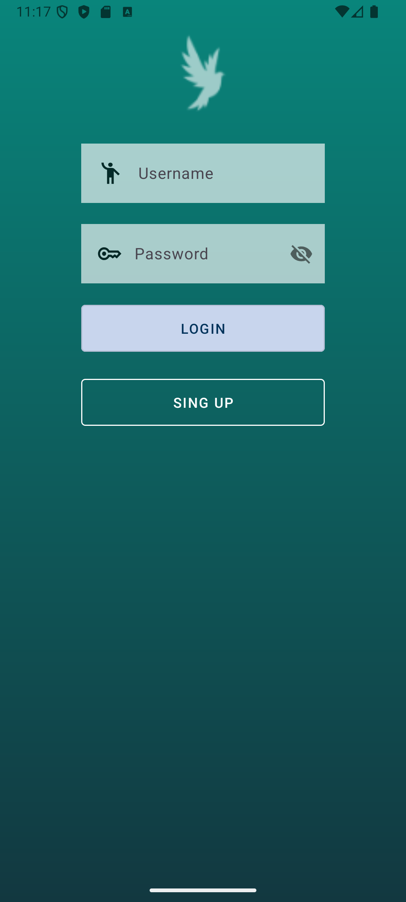
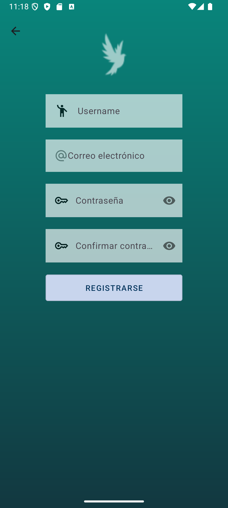
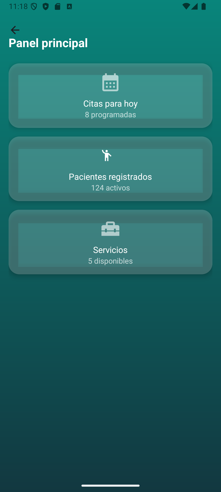
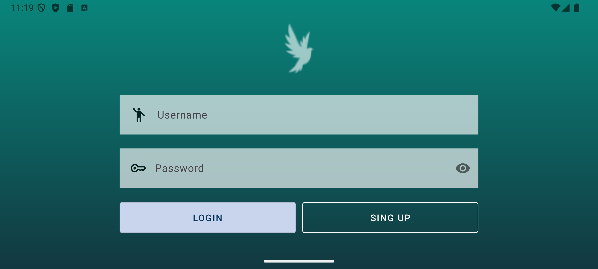
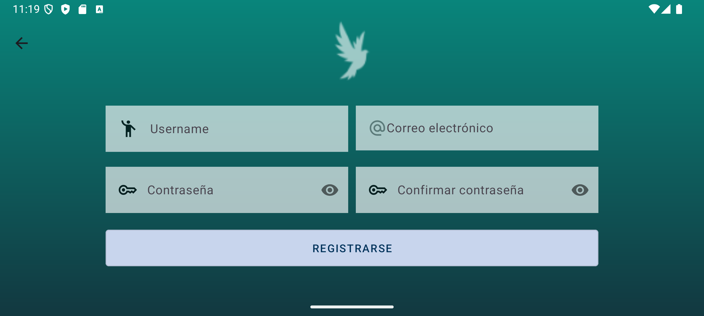

# NiceStart 

Este proyecto de la asignatura **Desarrollo de Interfaces** en **Desarrollo de Aplicaciones Multiplataforma (DAM)**, desarrollada con **Java** y **XML**.

## Tecnologías

## Vista Vertical

<table>
  <tr>
    <th>Login</th>
    <th>Sign Up</th>
    <th>Pantalla principal</th>
  </tr>
  <tr>
    <td></td>
    <td></td>
    <td></td>
  </tr>
</table>

## Vista Horizontal

<table>
  <tr>
    <th>Login</th>
    <th>Sign Up</th>
  </tr>
  <tr>
    <td></td>
    <td></td>
  </tr>
</table>

## Autor
- **Jhon Hau Yon** – [https://github.com/J-HY](https://github.com/J-HYL)

Proyecto desarrollado como parte de la asignatura **Desarrollo de Interfaces** en **DAM**.

